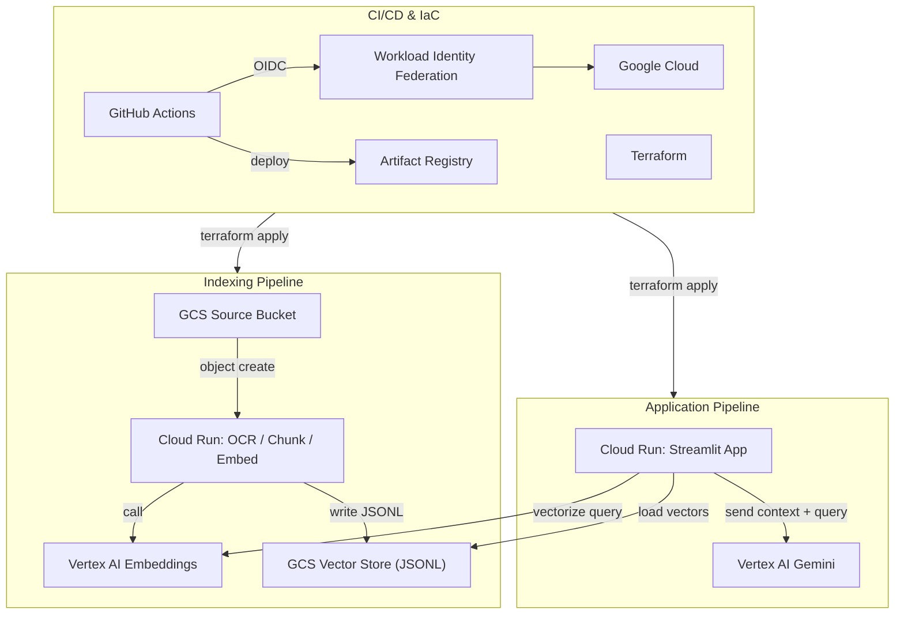

# RAGシステム ポートフォリオ (GCP & Vertex AI)

## 概要
このプロジェクトは、Google Cloud Platform (GCP) と Vertex AI を活用して構築した **RAG (Retrieval-Augmented Generation)** のポートフォリオです。  
複雑で検索が困難な資料（例：行政が公開するPDF）の内容を、**自然言語の対話**で簡単かつ正確に引き出すことを目的としています。

- **技術の柱**
  - **アプリ**: Cloud Run（Streamlit）
  - **インデクシング**: Cloud Run（OCR＋分割＋埋め込み生成）
  - **ベクトル格納**: **GCS(JSONL)** をシンプルなベクトルストアとして採用（外部DB不要）
  - **IaC**: Terraform（GCSバックエンドでステート管理）
  - **CI/CD**: GitHub Actions + Workload Identity Federation（**鍵レス**運用）
  - **デプロイ順序保証**: イメージは **digest** で固定

---

## 開発アプローチ：評価駆動型アジャイル開発
- **フェーズ1（完了）**: コア機能を持つ **MVP** を素早く構築（最短で価値検証）。
- **フェーズ2（進行中）**: **自動評価の基盤**（Faithfulness / Relevancy など）を整備。改善の効果を **数値で証明**。
- **フェーズ3（計画）**: ボトルネックを評価値で特定し、BigQuery Vector Search 等へ置換して **高速化**。

> 方針：**精度改善の前に精度を計測できる仕組みを作る**ことで、データに基づく継続改善を実現します。質問と模範解答のペアで構成される評価用データセットを準備し、RAGでの生成回答と模範解答をLLMで比較します。このようなLLM-as-a-judge（審査員としてのLLM）のアプローチをとることで、精度評価を自動で定量的に行える仕組みを構築します。

---

## アーキテクチャ


---

## 環境・命名規則
| 項目 | 値 |
|---|---|
| **GCP プロジェクト** | `serious-timer-467517-e1` |
| **リージョン** | `us-central1`（最新モデル/サービスに揃えるため統一） |
| **Artifact Registry** | リポジトリ: `rag-portfolio-repo` |
| **Cloud Run（staging）** | `ocr-function-staging`, `rag-portfolio-app-staging` |
| **Cloud Run（prod）** | `ocr-function-prod`, `rag-portfolio-app-prod` |
| **GCS（staging）** | `bkt-<PROJECT_ID>-rag-resource-staging` / `bkt-<PROJECT_ID>-rag-output-staging` |
| **GCS（prod）** | `bkt-<PROJECT_ID>-rag-resource-prod` / `bkt-<PROJECT_ID>-rag-output-prod` |
| **Terraform backend** | GCS: `bkt-<PROJECT_ID>-tfstate`（prefix: `terraform/state`） |

> Cloud Run の環境変数（例：`VECTOR_BUCKET_NAME`, `OUTPUT_BUCKET_NAME`）も Terraform で管理。

---

## CI/CD（digest デプロイ）
| Workflow | トリガー | 役割 |
|---|---|---|
| `pr-staging-infra-deploy.yml` | `pull_request`（`terraform/**` 変更時）／手動 | **stagingインフラ**の Plan/Apply（WIFで認証、並列制御あり） |
| `pr-staging-apptest-deploy.yml` | `pull_request` | アプリのビルドと軽量テスト |
| `pr-staging-destroy.yml` | PR close／手動 | staging のクリーンアップ（必要に応じて） |
| `merge-prod-infra-deploy.yml` | **手動実行のみ** | **本番インフラ**の Plan/Apply（ヒューマンゲート） |
| `merge-prod-app-deploy.yml` | `main` への push（`app/**`, `ocr-function/**` 変更時） | Build & Push → **digest 指定**で Cloud Run デプロイ |

- 認証は **`google-github-actions/auth@v2` + WIF**。秘密鍵は使いません。
- イメージの **Push はタグ**、**デプロイは digest 固定**（不変参照で順序/再現性を担保）。

---

## 運用メモ（Runbook）
- **staging 適用**: PRを作ると `pr-staging-infra-deploy` が自動で `init → plan → apply`。手動実行も可。
- **prod インフラ**: `merge-prod-infra-deploy` を Actions から **手動実行**。
- **prod アプリ**: `main` に push すると `merge-prod-app-deploy` が **digest デプロイ**。
- **Destroy（staging）**: `pr-staging-destroy` を手動で。完全削除が必要な時だけ `prevent_destroy` を一時的に無効化。

---

## コスト方針（目安）
- デフォルトは **`min_instance = 0`**（コールドスタート許容で節約）。体験重視時は `1` に変更。
- 実コストは **Cloud Billing レポート** と **Cloud Run / GCS / Artifact Registry** のメトリクスで確認。

---

## テスト戦略
- **ユニット**: `find_similar_chunks` 等のロジックを `pytest` で検証（`numpy` など最低限の依存を固定）。
- **統合**: HTTP でバックエンド（Cloud Run）を直叩きして疎通と応答時間を測定。
- **自動評価（計画）**: LLM-as-a-judge（RAGAs 等）で **Faithfulness / Relevancy** を CI サマリに可視化。

---

## 開発ロードマップ
- **Phase 1: MVP（完了）**  
  RAGの投入→ベクトル化→検索→回答の最小機能を、Cloud Run + GCS(JSONL) で **最短実装**。
- **Phase 2: CI/CD と自動評価（進行中）**  
  ワークフロー整備、テスト充実、評価スコアの自動算出・可視化。
- **Phase 3: 性能・拡張性**  
  **BigQuery Vector Search** への移行、**Dataflow** での大規模処理、リランキング導入。

---

## 再現手順（開発者向けメモ）
```bash
# 1) Terraform 初期化（staging 例）
cd terraform
terraform init -reconfigure -upgrade
terraform workspace select staging || terraform workspace new staging

# 2) 変数（ローカル/CI共通）
export TF_VAR_project_id="serious-timer-467517-e1"
export TF_VAR_region="us-central1"
export TF_VAR_environment="staging"
export TF_VAR_source_bucket_name="bkt-serious-timer-467517-e1-rag-resource-staging"
export TF_VAR_output_bucket_name="bkt-serious-timer-467517-e1-rag-output-staging"

# 3) 既存 Cloud Run を Terraform 管理下に取り込む（初回のみ）
terraform import 'google_cloud_run_v2_service.rag_app' \
  "projects/${TF_VAR_project_id}/locations/${TF_VAR_region}/services/rag-portfolio-app-staging" || true
terraform import 'google_cloud_run_v2_service.ocr_function' \
  "projects/${TF_VAR_project_id}/locations/${TF_VAR_region}/services/ocr-function-staging" || true

# 4) 差分と適用
terraform plan -input=false
terraform apply -auto-approve -input=false
```

---

## 補足：設計判断の要点
- **GCS(JSONL) ベクトルストア**: MVP は依存とコスト最小化を優先。必要になったら BigQuery Vector Search へ。
- **リージョン統一**: `us-central1` に統一して、最新モデルとサービスを利用。
- **digest デプロイ**: ロールバック容易、順序保証、再現性確保。
- **既存リソースは import**: 破壊・再作成ではなく **非破壊で整合**を取る。