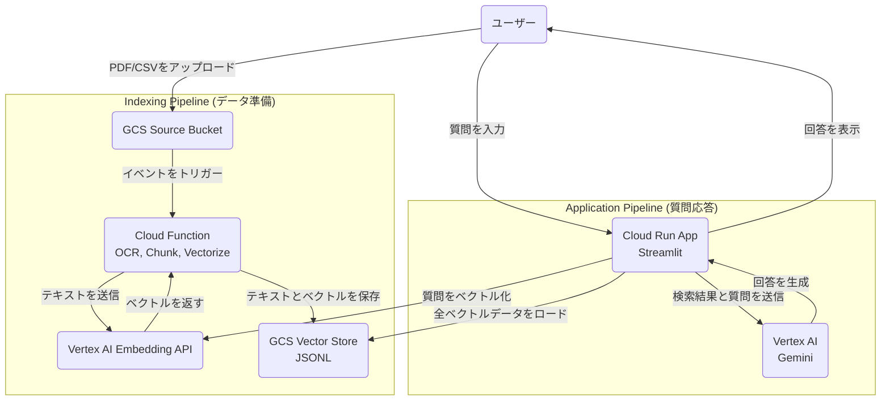

# RAGシステム ポートフォリオ (GCP & Vertex AI)

## 概要

このプロジェクトは、Google Cloud Platform (GCP) の各種サービスとVertex AIの生成AIモデルを活用して構築した、RAG (Retrieval-Augmented Generation) システムのポートフォリオです。

複雑で検索が困難なドキュメント（例：行政の公開するPDF資料）の内容を、自然言語による対話形式で簡単かつ正確に引き出すことを目的としています。

## 開発アプローチ：評価駆動型アジャイル開発

本プロジェクトは、**評価駆動型のアジャイル開発**アプローチを採用しています。

まず、システムのコア機能を持つ**MVP（実用最小限の製品）**を迅速に構築しました（フェーズ1）。
次に、システムの性能（回答精度・速度）を**定量的に自動評価する仕組み**を構築します（フェーズ2）。この評価基盤があることで、将来的な機能改善（例：ベクトル検索の高速化）が、実際にどれほどの効果をもたらしたのかを客観的な数値で証明することが可能になります。

「改善の前に、まず測定の仕組みを作る」というこのアプローチは、データに基づいた継続的なシステム改善を実現するための、意図的な戦略的判断です。そのため、プロンプトのチューニングといった個別の精度改善は、この評価基盤が完成するフェーズ3以降で本格的に着手する計画です。

## アーキテクチャ

## 開発ロードマップ

### Phase 1: MVP (Minimum Viable Product) の構築

* **目的**: RAGシステムのコア機能（データ投入→ベクトル化→検索→回答生成）を、IaC (Terraform) を用いて迅速に構築する。
* **状態**: **完了**

MVPの迅速な構築という目標に基づき、このフェーズでは以下の技術選定と設計を意図的に行いました。

#### 技術選定の意図

* **ベクトル検索：GCS上のJSONLファイル + アプリ内検索**
    * **選定理由**: 外部データベースへの依存をなくし、最もシンプルかつ迅速にRAGのコア検索機能を実現するため。また、小規模なデータ量を扱うMVP段階では、専用データベースの常時稼働コストを回避できる最も安価な構成であるため。

* **データ処理パイプライン：Cloud Function**
    * **選定理由**: GCSイベントとの連携が標準機能で提供されており、MVPの「ファイルが置かれたら処理する」という要件に最適であるため。また、サーバレスでコスト効率も高い。

* **デプロイフロー：Terraform + `local-exec`**
    * **選定理由**: まずはインフラ定義とアプリケーションのデプロイ指示をTerraformに一元化し、手動デプロイを排除して再現性を確保する第一歩として採用。

### Phase 2: CI/CDと自動評価パイプラインの構築

* **目的**: システムの品質を継続的に担保し、将来の改善効果を客観的に測定するための土台を築く。
* **主なタスク**:
    * [ ] **CI/CDパイプラインの構築 (GitHub Actions)**: `main`ブランチへのマージをトリガーに、テスト、コンテナビルド、デプロイを自動化するワークフローを構築する。
    * [ ] **テスト戦略の導入 (テストピラミッド)**:
        * **ユニットテスト**: `find_similar_chunks`関数など、個々のロジックが正しく動作することを`pytest`で検証する。
        * **統合テスト**: UIを介さず、HTTPリクエストを直接送信し、質問応答のバックエンドロジ-ック全体（Vertex AI連携含む）が正常に動作することを検証する。
    * [ ] **自動評価基盤の構築**:
        * **評価データセット**: 評価用のFAQ（質問と模範解答のペア）を`evaluation_set.json`としてリポジトリに配置する。
        * **評価スクリプト (Pytest)**: デプロイ完了後、GitHub Actions上で以下の処理を行う`pytest`テストを実装する。
            1.  各質問をCloud RunアプリにHTTPリクエストとして送信し、**応答速度**を計測する。
            2.  **LLM-as-a-judge (審査員としてのLLM)** のアプローチを採用。**RAGAs**フレームワークなどを利用し、生成された回答の**忠実性 (Faithfulness)** や**関連性 (Answer Relevancy)** を自動でスコアリングする。
    * [ ] **評価結果の可視化**: 評価結果（平均スコア、平均応答時間）をGitHub Actionsの実行結果サマリーに出力する。

### Phase 3: データパイプラインの高度化と性能改善

* **目的**: フェーズ2で構築した評価基盤を使い、データパイプラインのボトルネックを解消し、性能（速度・精度・拡張性）を向上させる。改善前後のスコアを比較し、改善効果を定量的に示す。
* **主なタスク**:
    * [ ] **ベクトル検索の高速化**: 現在のアプリ内検索から**BigQuery Vector Search**に移行し、応答速度の向上を目指す。
    * [ ] **データ処理の強化**: 大規模データに対応するため、Cloud Functionを**Cloud Dataflow**パイプラインに置き換える。
    * [ ] **データ収集の自動化**: Cloud SchedulerとCloud Run JobsによるWebクローラーを実装。

### Phase 4: アプリケーションの機能拡張

* **目的**: RAGシステムとしての完成度をさらに高めるための追加機能を実装する。
* **主なタスク**:
    * [ ] **リランキング機能の実装**: 検索精度の向上のため、リランカーモデルを導入。
    * [ ] **会話履歴の記憶**: Firestoreなどを活用し、対話の文脈を維持。
    * [ ] **UIテスト (E2E)**: `pytest-playwright`を導入し、ユーザー操作を模倣したブラウザテストを実装する。